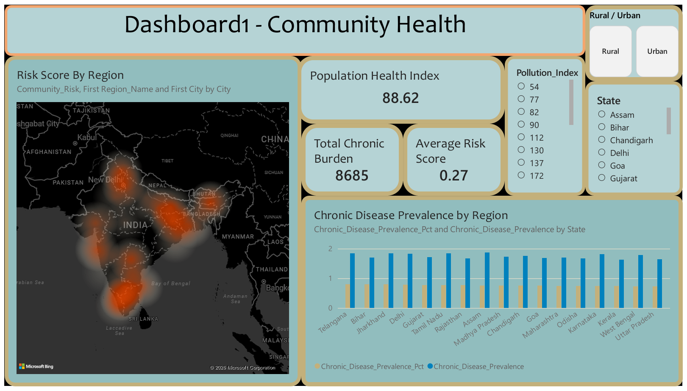
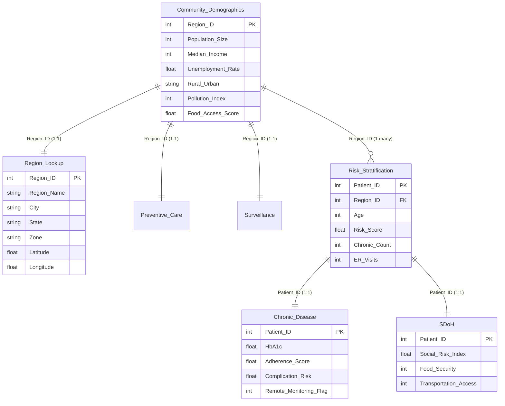
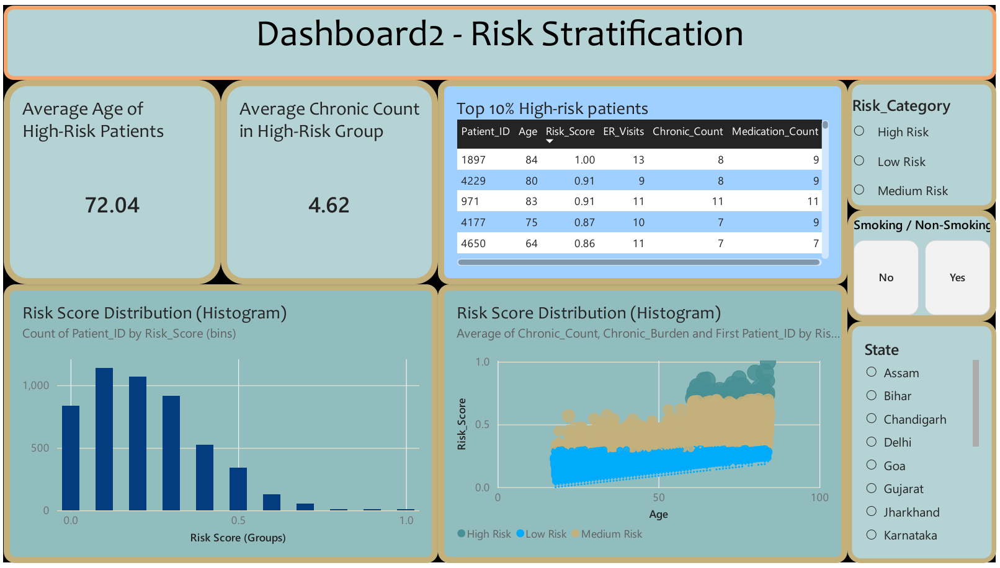
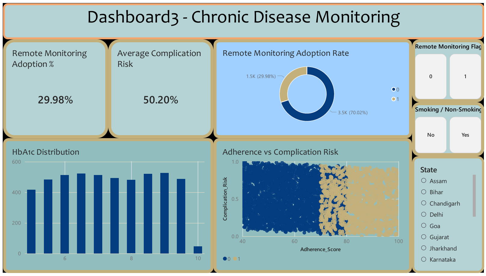
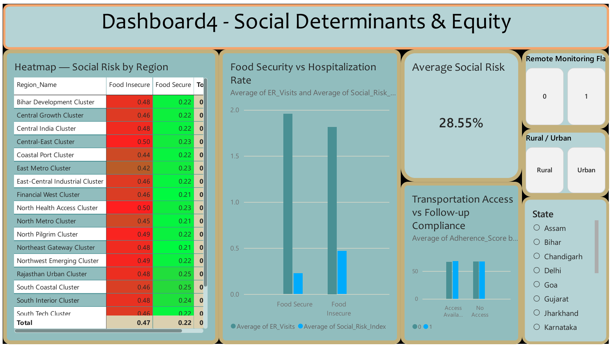
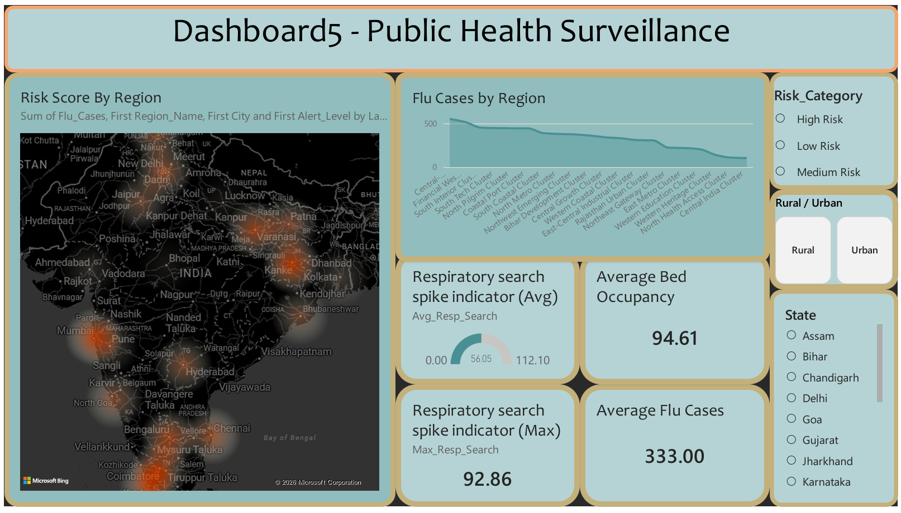

# Population Health Management — Community Health Analytics (Power BI)


A five-page Power BI report that takes a **population health management (PHM)** view of community health across 20 Indian city clusters — moving from *"how healthy is this population?"* down to *"which 500 patients should a care team call on Monday morning?"*

The report links clinical risk, chronic disease control, social determinants of health (SDoH), and public health surveillance into a single snowflake model hubbed on community demographics, then layers **what-if parameters** on top so a planner can simulate the impact of an intervention before funding it.



---

## Table of Contents

- [Why this project](#why-this-project)
- [Dataset at a glance](#dataset-at-a-glance)
- [Data model](#data-model)
- [Dashboard walkthrough](#dashboard-walkthrough)
- [DAX measures](#dax-measures)
- [What-if parameters](#what-if-parameters)
- [Key findings](#key-findings)
- [Limitations and honest notes](#limitations-and-honest-notes)
- [How to run this](#how-to-run-this)
- [Repository structure](#repository-structure)
- [Skills demonstrated](#skills-demonstrated)

---

## Why this project

Most healthcare dashboards stop at descriptive reporting — how many admissions, how many beds. Population health management asks a harder question: **given a fixed budget, where does the next rupee of prevention spending do the most good?**

Answering that needs four things stitched together, which is exactly how this report is organised:

1. **Where** is the burden concentrated? (geography and demographics)
2. **Who** inside that population is at risk? (patient-level stratification)
3. **Why** are they at risk clinically? (chronic disease control)
4. **What** non-clinical barriers keep them at risk? (social determinants)

…plus a fifth page for **early warning**, because a good PHM programme also has to catch the outbreak that ruins the plan.

---

## Dataset at a glance

Seven CSV tables at two grains — **patient** (5,000 rows) and **region** (20 rows).

| Table | Grain | Rows | Key columns |
| --- | --- | ---: | --- |
| `Risk_Stratification.csv` | Patient | 5,000 | `Patient_ID`, `Region_ID`, `Age`, `BMI`, `Smoking_Status`, `Chronic_Count`, `ER_Visits`, `Medication_Count`, `Risk_Score` |
| `Chronic_Disease.csv` | Patient | 5,000 | `Patient_ID`, `HbA1c`, `BP_Systolic`, `LDL_Level`, `Remote_Monitoring_Flag`, `Adherence_Score`, `Complication_Risk` |
| `SDoH.csv` | Patient | 5,000 | `Patient_ID`, `Housing_Stability`, `Income_Level`, `Transportation_Access`, `Food_Security`, `Social_Risk_Index` |
| `Region_Lookup.csv` | Region | 20 | `Region_ID`, `Region_Name`, `City`, `State`, `Zone`, `Latitude`, `Longitude` |
| `Community_Demographics.csv` | Region | 20 | `Region_ID`, `Population_Size`, `Median_Income`, `Unemployment_Rate`, `Rural_Urban`, `Pollution_Index`, `Food_Access_Score` |
| `Preventive_Care.csv` | Region | 20 | `Region_ID`, `Vaccination_Rate`, `Screening_Uptake`, `Lifestyle_Program_Enrollment`, `Preventable_Admission_Rate` |
| `Surveillance.csv` | Region | 20 | `Region_ID`, `Respiratory_Search_Index`, `Flu_Cases`, `Hospital_Bed_Occupancy`, `Alert_Level` |

**Coverage:** 20 named clusters across **17 states** and 6 zones (North 5, South 5, East 4, West 4, Central 1, Northeast 1); 12 rural and 8 urban.

**Ranges worth knowing:** `Age` 18–84 · `HbA1c` 5.0–10.0 · `Risk_Score` 0–1 · `Adherence_Score` ~40–100 · `Social_Risk_Index` ∈ {0, 0.25, 0.5, 0.75, 1.0}

`Social_Risk_Index` is a **four-factor composite** — one quarter-point for each of unstable housing, low income, no transport access, and food insecurity. That is why it only ever takes five values.

---

## Data model

A **snowflake** model with `Community_Demographics` as the central hub. Every region-grain table joins to it on `Region_ID`, and the two patient-grain tables reach it indirectly through `Risk_Stratification` on `Patient_ID`.



**Why the relationships are one-to-one.** `Region_ID` is unique in all four region tables — 20 rows, 20 distinct IDs each — so Power BI resolves `Community_Demographics` against `Region_Lookup`, `Preventive_Care`, and `Surveillance` as **1:1**. `Risk_Stratification` is the only table on a many side: 5,000 patients across the same 20 regions. `Chronic_Disease` and `SDoH` carry no `Region_ID` at all, so `Patient_ID` is their only path into the model.

**Why cross-filtering is bidirectional on several edges.** Because the hub is the demographics table rather than `Region_Lookup`, geography is a *satellite* of the hub instead of the root of a star. A slicer on `Region_Lookup[State]` therefore has to travel **up into `Community_Demographics` and back down** to reach `Risk_Stratification`. Single-direction filters would not propagate that way across a 1:1 join, which is why the model enables bidirectional cross-filtering on those relationships. The trade-off is real: it makes the cross-page slicers on `State`, `Rural_Urban`, `Risk_Category`, `Smoking_Status`, and `Remote_Monitoring_Flag` work everywhere, at the cost of ambiguity risk that a conventional star (with `Region_Lookup` promoted to the root) would avoid.

`Region_Lookup` supplies the latitude/longitude that let **patient-grain** risk scores render on the **region-grain** maps on Dashboards 1 and 5.

Calculated columns added in the model (not present in the raw CSVs): `Risk_Category`, `Chronic_Burden`, `Community_Risk`, `Chronic_Disease_Prevalence`, `Food_Security_Label`, `Transport_Access_Label`, plus binned columns `Risk_Score (bins)` and `HbA1c (bins)`.

---

## Dashboard walkthrough

### 1 · Community Health — *where is the burden?*


The orientation page. A geospatial heat map plots `Community_Risk` by city, while a dual-axis bar chart contrasts chronic disease **count** against **prevalence %** by state — the distinction that stops a planner from simply chasing the largest state.

| KPI | Value |
| --- | --- |
| Population Health Index | **88.62** |
| Total Chronic Burden | **8,685** conditions |
| Average Risk Score | **0.27** |

Slicers: `Rural / Urban`, `State`, `Pollution_Index`.

---

### 2 · Risk Stratification — *who needs a care manager?*



This is the page that turns analysis into a work queue. The histogram shows `Risk_Score` is **heavily right-skewed** — most people are fine, a thin tail is not — and the `Age` vs `Risk_Score` scatter, coloured by risk band, shows risk climbing steadily with age while the bands stay cleanly separated.

The **Top 10% High-Risk Patients** table is the deliverable: a sortable, slicer-responsive roster with `Age`, `Risk_Score`, `ER_Visits`, `Chronic_Count`, and `Medication_Count`.

| KPI | Value |
| --- | --- |
| Average Age of High-Risk Patients | **72.04** |
| Average Chronic Count in High-Risk Group | **4.62** |

The high-risk cohort is roughly **500 patients (the top decile)**, averaging **72 years old with 4.6 chronic conditions each** — a small, concrete, callable list rather than an abstraction.

---

### 3 · Chronic Disease Monitoring — *why are they at risk clinically?*



An HbA1c distribution spread across the diabetic range, a donut for remote-monitoring adoption, and — the most interesting visual in the report — an `Adherence_Score` vs `Complication_Risk` scatter split by monitoring flag.

| KPI | Value |
| --- | --- |
| Remote Monitoring Adoption | **29.98%** |
| Average Complication Risk | **50.20%** |

Only **3 in 10 patients** are on remote monitoring. The adherence scatter shows monitored patients (flag = 1) clustering at the **high-adherence end of the x-axis** — the single clearest intervention signal in the dataset.

---

### 4 · Social Determinants & Equity — *what non-clinical barriers exist?*



A conditionally-formatted matrix ranks social risk by region and food-security status, alongside comparisons of food security against ER utilisation and transport access against follow-up compliance.

| KPI | Value |
| --- | --- |
| Average Social Risk | **28.55%** |

The heatmap is unambiguous: **food-insecure patients carry roughly double the social risk of food-secure patients in every single one of the 20 regions** (~0.47 vs ~0.22). Social risk travels with food insecurity everywhere — it is not a regional quirk.

---

### 5 · Public Health Surveillance — *what is about to go wrong?*



The early-warning page. Flu case volume by region, a geospatial alert-level map, and two gauges tracking a respiratory search-trend index (a proxy for the kind of digital signal that leads clinical presentation by days to weeks).

| KPI | Value |
| --- | --- |
| Average Flu Cases | **333.00** |
| Average Bed Occupancy | **94.61%** |
| Respiratory Search Spike (Max) | **92.86** |

**Average bed occupancy sits at 94.61%** — above the ~85% threshold at which hospital systems are generally considered to lose surge capacity. Every region reports an alert level of Low (14) or Medium (6); none are High.

---

## DAX measures

Measures are organised by their home table. The definitions live inside `Community Health.pbix`; the formulas below are **reconstructions** of the aggregation each measure performs — every one has been validated against the source CSVs and reproduces the exact figure printed on the dashboard.

**Core aggregates — reproduced to the decimal from the raw data:**

```dax
Total Chronic Burden = SUM( Risk_Stratification[Chronic_Count] )          -- 8,685
Average Risk Score   = AVERAGE( Risk_Stratification[Risk_Score] )         -- 0.2695
Avg_Complication_Risk = AVERAGE( Chronic_Disease[Complication_Risk] )     -- 0.5020
Remote_Monitoring_Adoption_Pct =
    DIVIDE(
        CALCULATE( COUNTROWS( Chronic_Disease ), Chronic_Disease[Remote_Monitoring_Flag] = 1 ),
        COUNTROWS( Chronic_Disease )
    )                                                                     -- 29.98%
Avg_Social_Risk  = AVERAGE( SDoH[Social_Risk_Index] )                     -- 28.55%
Avg_Flu_Cases    = AVERAGE( Surveillance[Flu_Cases] )                     -- 333.00
Avg_Bed_Occupancy = AVERAGE( Surveillance[Hospital_Bed_Occupancy] )       -- 94.61
Max_Resp_Search  = MAX( Surveillance[Respiratory_Search_Index] )          -- 92.86
```

**Cohort-filtered measures** use `CALCULATE` to scope to the high-risk band:

```dax
Avg_Age_High_Risk =
    CALCULATE( AVERAGE( Risk_Stratification[Age] ),
               Risk_Stratification[Risk_Category] = "High Risk" )         -- 72.04

Avg_Chronic_High_Risk =
    CALCULATE( AVERAGE( Risk_Stratification[Chronic_Count] ),
               Risk_Stratification[Risk_Category] = "High Risk" )         -- 4.62
```

**Full measure inventory**, grouped by home table:

| Table | Measures |
| --- | --- |
| `Risk_Stratification` | `Population_Health_Index`, `Avg_Age_High_Risk`, `Avg_Chronic_High_Risk`, `Risk_Rank`, `Chronic_Risk_Reduction`, `Dynamic_Pop_Health_Score` |
| `Chronic_Disease` | `Avg_Complication_Risk`, `Remote_Monitoring_Adoption_Pct`, `Cost_Savings` |
| `SDoH` | `Avg_Social_Risk`, `Prevention_ROI`, `Dynamic_Equity_Score` |
| `Surveillance` | `Avg_Flu_Cases`, `Avg_Bed_Occupancy`, `Avg_Resp_Search`, `Max_Resp_Search` |
| `Preventive_Care` | `Adjusted_Admissions` |

The scenario measures — `Dynamic_Pop_Health_Score`, `Dynamic_Equity_Score`, `Chronic_Risk_Reduction`, `Prevention_ROI`, `Cost_Savings`, `Adjusted_Admissions` — are the ones wired to the what-if parameters below. `Risk_Rank` uses `RANKX` to drive the Top 10% roster.

---

## What-if parameters

Four disconnected parameter tables (built with `GENERATESERIES`) let a planner **simulate an intervention without touching the data**:

| Parameter | Simulates |
| --- | --- |
| `Vaccination Coverage` | Raising immunisation rates → recalculates `Adjusted_Admissions` |
| `Lifestyle Program Coverage` | Expanding lifestyle enrolment → feeds `Chronic_Risk_Reduction` |
| `Remote Monitoring Adoption` | Scaling remote monitoring → feeds `Cost_Savings` |
| `Social Risk Intervention` | Funding SDoH support → feeds `Dynamic_Equity_Score` and `Prevention_ROI` |

This is the step that separates a *report* from a *planning tool*. Instead of stating that remote monitoring correlates with better adherence, the user can drag adoption from 30% to 60% and watch projected cost savings and the population health score respond.

---

## Key findings

1. **Risk is concentrated, not diffuse.** The `Risk_Score` distribution is sharply right-skewed. About **500 of 5,000 patients (10%)** sit above the high-risk threshold, averaging 72 years old with 4.6 chronic conditions. Targeting that decile is far cheaper than any population-wide programme.

2. **Remote monitoring is the clearest lever available.** Adoption is only **29.98%**, and monitored patients concentrate at the high-adherence end of the adherence/complication scatter. Roughly 3,500 patients are not enrolled.

3. **Food insecurity is the dominant social determinant.** In **all 20 regions**, food-insecure patients show ~2× the social risk of food-secure patients (~0.47 vs ~0.22). No region escapes the pattern, which argues for a national rather than regional response.

4. **Surge capacity is already gone.** Average bed occupancy of **94.61%** leaves almost no headroom, even though every region is currently flagged Low or Medium. The surveillance page exists precisely because a system this full cannot absorb a spike.

5. **Chronic burden and prevalence tell different stories.** Dashboard 1 deliberately plots both, since the states with the largest absolute burden are not the states with the highest prevalence — and prevalence is what a per-capita intervention budget should follow.

---

## Limitations and honest notes

Stating these plainly matters more in healthcare analytics than in most domains.

- **The data is synthetic.** `Patient_ID` runs sequentially from 1 to 5,000, `Hospital_Bed_Occupancy` is capped at 100.0, and the value distributions are clearly generated. **No real patient data or PHI is present in this repository**, and none of the findings above should be read as clinical or policy evidence about any real Indian state.

- **The SDoH → outcome relationships are essentially null in this dataset.** This is worth being explicit about, because Dashboard 4 *looks* like it demonstrates them. Joining the tables directly:

  | Comparison | Result |
  | --- | --- |
  | Mean `ER_Visits`, food-insecure vs food-secure | 1.82 vs **1.96** |
  | Mean `Adherence_Score`, no transport vs transport access | 66.95 vs 67.53 |

  Food-**secure** patients record *slightly more* ER visits, and transport access moves adherence by half a point. Both are the opposite of, or indifferent to, the published literature. The columns were generated independently, so no causal signal exists to find. The visuals are correct; the underlying correlation simply is not there, and I would rather say so than let a reader infer a relationship the data does not support.

  The food-insecurity/social-risk finding (#3) **is** real within the data — but only because `Food_Security` is one of the four inputs to `Social_Risk_Index` by construction. It is an arithmetic identity, not a discovery.

- **`Social_Risk_Index` is ordinal, not continuous.** It takes five discrete values. Averaging it produces a valid index but not a probability.

- **The `Risk_Category` cut point is reconstructed.** Matching the published KPIs (72.04 / 4.62) against the raw data locates the High Risk boundary at approximately `Risk_Score > 0.5`, which yields ~500 patients — consistent with the "Top 10%" framing. The authoritative definition lives in the `.pbix`.

---

## How to run this

**Requirements:** [Power BI Desktop](https://powerbi.microsoft.com/desktop/) (free). The map visuals need an internet connection for Bing Maps tiles.

1. Clone the repository:
   ```bash
   git clone https://github.com/Vireen555/phm-healthcare-powerbi-dashboard.git
   cd phm-healthcare-powerbi-dashboard
   ```
2. Open `Community Health.pbix` in Power BI Desktop.
3. If prompted about data sources, point the queries at the `Datasets/` folder:
   **Transform data → Data source settings → Change Source…**
4. **Refresh** to reload all seven tables.

Prefer not to install anything? `Community Health.pdf` is a full static export of all five pages.

---

## Repository structure

```
phm-healthcare-powerbi-dashboard/
├── Community Health.pbix        # The Power BI report — model, DAX, visuals
├── Community Health.pdf         # Static export of all 5 dashboard pages
├── Datasets/
│   ├── Risk_Stratification.csv  # 5,000 patients — risk scores, utilisation
│   ├── Chronic_Disease.csv      # 5,000 patients — HbA1c, adherence, complications
│   ├── SDoH.csv                 # 5,000 patients — social determinants
│   ├── Community_Demographics.csv  # 20 regions — the model's central hub
│   ├── Region_Lookup.csv        # 20 regions — geography, lat/long for maps
│   ├── Preventive_Care.csv
│   └── Surveillance.csv
├── assets/
│   └── dashboard-1..5.png       # Page screenshots
├── LICENSE
└── README.md
```

---

## Skills demonstrated

**Data modelling** — a snowflake model across two grains (patient and region), hubbed on `Community_Demographics`; 1:1 joins on a `Region_ID` that is unique in every region table; bidirectional cross-filtering used deliberately so geography slicers propagate from a satellite table through the hub into patient-grain facts.

**DAX** — `CALCULATE` for cohort-scoped KPIs, `DIVIDE` for safe ratios, `RANKX` for the top-decile roster, `GENERATESERIES` for disconnected what-if parameter tables, and binning columns for distribution analysis.

**Report design** — a deliberate narrative arc across five pages (population → cohort → clinical → social → early warning); consistent cross-page slicers; KPI cards paired with the distribution behind them rather than presented alone.

**Healthcare domain** — risk stratification and top-decile targeting, HbA1c and medication-adherence monitoring, SDoH composite indices, and syndromic surveillance using search-trend proxies.

**Analytical judgement** — validating every published KPI against the source data, reconstructing undocumented thresholds from published aggregates, and documenting where the data does *not* support the story the visuals imply.

---

## License

Released under the [MIT License](LICENSE). The datasets are synthetic and contain no real patient information.

---

**Vireen Chowdary** · Built with Power BI Desktop and DAX
